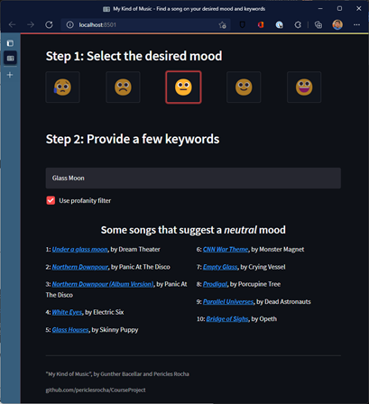

> Video presentation/tutorial: https://youtu.be/RMCBQ7bltt0 <br/>
> Try our app: https://mykindofmusic.azurewebsites.net/  <br/>

# My Kind of Music - project documentation

> University of Illinois at Urbana-Champaign <br/>
> CS 410 – Text Information Systems – Fall 2021
>
> Authors: 
> - Pericles Rocha (procha2 AT illinois DOT edu) – team leader/coordinator
> - Gunther Correa Bacellar (gunther6 AT illinois DOT edu) <br/>
>

Table of contents:

1. [Introduction](#introduction)
2. [How it works](#howitworks)
    1. [Measuring a song's sentiment based on lyrics](#measuresentiment)
        1. [Data cleaning](#datacleaning)
        2. [Song categorization](#songcategorization)
    2. [Song retrieval](#songretrieval)
    3. [Deploying the web application](#deployingthewebapplication)
    4. [User experience](#userexperience)
3. [Implementation details](#implementationdetails)
    1. [Solution files](#solutionfiles)
    2. [Conda requirements](#condarequirements)
    3. [Program functions](#programfunctions)
    4. [Installing the software](#installingthesoftware)
    5. [Running the software](#runningthesoftware)
        1. [Data preparation (optional)](#datapreparation)
        2. [Running the web application](#runningthewebapplication)
4. [Credits](#credits)
5. [Appendix](#appendix)
    1. [Appendix A: software usage tutorial presentation](#appendixa)
    2. [Appendix B: team member contribution](#appendixb)
    3. [Appendix C: credit and references](#appendixc)

## Introduction <a name="introduction"></a>
Music is an important part of human culture. While it is often thought of as simple entertainment, it can also impact how an individual feels and even affect their mood. In fact, music can be used in therapy to help relieve pressure, or to enhance certain feelings. People have pondered the possible therapeutic and mood boosting benefits of music for centuries.

Researchers at the Durham University, and the University of Jyvaskyla, Finland discovered  that even sad music can lift your mood. Others suggest music can boost happiness and reduce anxiety. In some cases, users may seek to enhance their current feeling, regardless of what that feeling is, and they seek for the right song to augment what they are feeling. From the drumbeats of our ancient ancestors to today’s unlimited streaming services, music is an integral part of the human experience. 

Our project is a recommendation system that suggests songs to a user based on their desired mood and a few keywords. We ask the user to provide what their desired mood is from a 5-level ordinal scale (very sad, sad, neutral, happy, and very happy) and some key words, and the software recommends songs that match that user-defined sentiment and keywords.

## How it works <a name="howitworks"></a>
There are two main parts to how the solution works: one is to use sentiment analysis techniques to determine the score sentiment of each song, and the other is to use text retrieval to fetch songs that match that sentiment using some keywords. Let’s look at those two parts in detail. 

### Measuring a song’s sentiment based on lyrics <a name="measuresentiment"></a>
Some songs sound sad, negative, while others sound the opposite. A user may choose a given sentiment because either they want to further potentialize a certain feeling, or they want to hear something that gives them the opposite feeling. For example: if an individual is feeling sad, they may want to hear some happy, positive songs to help them overcome that feeling. The alternative would be for another individual who is happy, excited, and needs that extra energy boost for a workout. Finally, there’s nothing wrong with being on a bad mood and wanting to hear sad songs: drama helps develop tolerance and make individuals more empathic. There’s no judgement whatsoever for the choice of sentiment an individual is looking to get from a song.

As far as the sentiment is concerned, modern sentiment analysis algorithms use natural language processing, text analysis, linguistics and more to systematically determine affective states of subjective information. These algorithms are widely used today to parse customer feedback, real-time response to ads or product launches through social media, and many more uses. While different techniques vary, sentiment analysis algorithms output a score that helps determine if the text being analyzed has a negative or positive stance. Our proposal is to leverage the same mechanism, but to provide a score that determines if a song’s lyrics are positive or negative. Instead of posing songs as positive or negative, we’re asking the user what their mood is between very sad and very happy, which seems to be more natural than asking them if they want songs with very negative or very positive sentiment. This is a design choice to make the application more natural.

Sentiment, however, is not binary. A user is not always very happy or very sad. Also, songs can have any sentiment from something very positive to very negative, and everything in between. To address this, we’ve chosen a scale that ranges sentiment between 1 and 5, from very sad to very happy. The five degrees of the scale are very sad (1), sad (2), neutral (3), happy (4) and very happy (5). Each song on our database is analyzed and assigned to a sentiment score, which we call a song’s mood. 
The song sentiment analysis is a batch process that happens before the user even sees the application. When songs are retrieved from the database, they have already been scored with a given mood – all we need to do next is to lookup the database for songs in the desired mood for retrieval. 

#### Data cleaning <a name="datacleaning"></a>
When we implemented the sentiment analysis algorithm on songs in our database, at first, we noticed two important data quality issues that we had to resolve:

- Songs that had very few words: some lyrics on our database are from songs that repeat only one or two words repeatedly. To address this issue, we decided to use only songs that had at least one complete verse on them. If you look at the structure of song lyrics, their hierarchy is: lyrics (full text), verses (blocks of 4 to 6 lines in average), and then lines. Analyzing all songs on our database, we noticed that verses have in average 24 words (six words in four lines). To achieve our goal to use only songs with at least one complete verse, our cut line became to only use songs with 24 words or more. This step removes 98 songs from our original database. 

- Songs on different languages: after removing songs with less than 24 words, we noticed that several songs were written in languages different from English. Even though the same techniques can be used on any languages, we wanted to focus this study on sentiment analysis and text retrieval for songs in English only. Therefore, we implemented a step to detect the language used in a song and discard any songs that were not written in English. This step removes 476 songs from our database.
As a result of this data cleaning process, we had 2426 song lyrics to work with (out of 3000 from the original database described in Appendix C). Other minor data quality issues were worked on to remove song metadata from the original lyrics’ files, address encoding issues, and others (e.g.: removing stop-words for tokenization). These steps did not remove any additional lyrics from our database.

#### Song categorization <a name="songcategorization"></a>
The ideal solution to this problem would be to get a large dataset, manually classify some songs, use pre-trained models, and train our own model that categorizes a song based on its mood. This would, with time and with further training iterations, make the ultimate song categorizer. Our testing proved promising on a supervised learning test using 15 different classifiers, with 73% accuracy when we used a random forest classifier, without doing any hyperparameters. However, we eventually discarded this approach because we could not find a large enough dataset that would make training statistically significant, and it would require intense manual work to read through lyrics and manually classify a training set. When we noticed that packages already available performed well and offered productivity gains over our approach, it became a matter of choosing one that’s optimal.

After experimenting with several open-source packages for sentiment analysis (NTLK, TextBlob, Flair, DeepMoji), we decided to use the Natural Language Toolkit (NLTK) package and the VADER model. It offered the best results and productivity in our scenario.

The VADER model analyses a text stream and provides four scores: 
-	**Negative** : the confidence that this content has negative content.
-	**Neutral**: the confidence that this content has neutral content.
-	**Positive**: the confidence that this content has positive content.
-	**Compound**: normalizes the negative, neutral, and positive scores to provide a single value.

The compound value is the one we decided to use in our analysis since it computes all polarity scores and produces a single value which we can use to determine the sentiment. Sample code: 
```python
import nltk
from nltk.sentiment.vader import SentimentIntensityAnalyzer

nltk.download('vader_lexicon')
sentiment = SentimentIntensityAnalyzer()
compound = sentiment.polarity_scores('Song Lyrics Here')['compound']
```

In the above example, **compound** is a real number that ranges from -1 to 1, where -1 is something with very negative sentiment and 1 is something with very positive sentiment. Because the compound score can be any value between -1 and 1, this scale is extremely convenient for our 5-scale mood system. Therefore, when we run the sentiment analysis algorithm providing the lyrics, we’ll retrieve the compound score and classify the song as follows:

<center>

Compound score | Mood | Mood description
-------------- | ---- |-----------------
|< -0.6 | 1 | Very Sad | 
|>= -0.6 and < -0.2 | 2 | Sad | 
|>= -0.2 and <= 0.2 | 3 | Neutral | 
|> 0.2 and <= 0.6 | 4 | Happy | 
|> 0.6 | 5 | Very Happy | 

<i> Table 1: compound ranges for song classification </i>

</center>
The ranges specified in the compound score on Table 1 evenly distributes the compound score in the five mood categories. 

When it comes to analyzing the song’s sentiment, we tested three different approaches to reach an optimal result: 

- Option A: **Run the analysis on the full song lyrics text at once.** This seemed to be the obvious way to approach this problem, but we then realized that almost 85% of all songs were categorized in the two extremes of the scale – very bad or very good moods. This looks suspicious and unbalanced, but when you think about the nature of music, it is dramatic and intense by design. Neutral songs may never see the light of day. 

<p align="center">
    
    <br/>    
    Image 1: Song distribution when scoping the full lyrics
</p>

- Option B: **Run the analysis on each verse and compute the song lyric average.** Some songs vary with different sentiment across the song lyrics, so we decided to measure the sentiment for each verse at a time, and then compute the average sentiment across all verses in a song’s lyrics. This produced a more balanced dataset across different mood categories, with higher number of songs on neutral. 

<p align="center">
    
    <br/>
    Image 2: Song distribution when scoping each verse individually
</p>

- Option C: **Run the analysis on each line and compute the song lyric average**. Following up on averaging the sentiment from verses, we wanted to test the results if we averaged each line at a time and then computed a song average. This produced poor, highly skewed results, with almost 90% of the songs categorized as neutral. This does not represent the reality observed in our dataset. 

<p align="center">
    
    <br/>    
    Image 3: Song distribution when scoping each line individually
</p>

The instance where we categorized songs by computing the averages from lyrics verses (option b, Image 2 above) seemed to produce our favorite results, and it became our choice for the application deployed to users. The song categorization on verse scope produces a bell-curved distribution that realistically represents our dataset.

As songs are categorized, they are written to a comma-separated (.csv) file with four columns: 

- **Title**: the song’s title
- **Artist**: name of the artist who authored or recorded the song
- **Lyrics**: the actual lyrics text
- **Sentiment**: 1-5 sentiment scale

This comma-separated file is used as the application database, and to create the reverse index used on song retrieval. 

### Song retrieval <a name="songretrieval"></a>
For the song lyrics retrieval step, we first load the comma-separated file containing all lyrics, titles, artists, and sentiments. As we believe the song title is an important component to be part of the retrieval experience, we started by adding the song title to the lyrics that will be indexed.

Second, we produced some transformations using Spacy (Python package) NLP pipeline with the en_core_web_sm tokenization rules specific for English, lowering case the lyrics and tokenizing each of the lyrics in 5 different mood groups. 

Third, we used the rank-bm25 package to build a dictionary containing the 5 different BM25 inverted indexes, one for each group of songs categorized by mood.

Fourth, we tried to fine-tune the values for k and b for the BM25 index, but we realized the default values of k=1.5 and b=0.75 already provided good results.

Finally, we saved the dictionary of indexes using the Pickle package. The pickle file is available to be read by the web application without the need to reindex the whole song lyrics dataset. In case we change the lyrics dataset, we need to run the data preparation script to recreate the dictionary of indexes.

Now, when the web application is initialized, it quickly reads the lyrics dataset with sentiment (1-5) per song as well as the dictionary of indexes per sentiment (1-5). Then, by tokenizing the query input provided by the user, we are able to return in descending order the top 10 songs retrieved using the tokenized query and the right BM25 index based on the mood selected, showing the results to the end user.

### Deploying the web application <a name="deployingthewebapplication"></a>
After testing the web app locally using Streamlit, we packaged in it in a Docker container, registered the container to a container registry, and deployed it as a web application hosted in Microsoft Azure App Service. Hosting the app in cloud allow us to scale performance if necessary and easily deploy new versions. We’ve made it available at http://musicmood.azurewebsites.net for anyone interested in testing the use cases without having to deploy the application locally.

### User experience <a name="userexperience"></a>
Once a user runs the application, they are asked to select their desired mood by clicking on emojis that represent the 1-5 mood scale, and to type a few keywords that they’d like to see in song lyrics. The application retrieves ten songs from the database based on the mood and word relevance and displays the results to the user. Each song result links to a YouTube search, where the user can immediately hear that song. 


<p align="center">
    
    <br/>
    Image 4: User flow
</p>


The application consumes the previously processed databased that already has songs categorized by sentiment but performs keyword search in real time by checking one of the five inverted indexes available as a dictionary.

<p align="center">
    
    <br/>
    Image 5: Description of UX elements
</p>

Many songs may have explicit content, so we offer the user the ability to use a profanity filter, if desired. This option, which is enabled by default, still retrieves songs with explicit content, but masks profanity words from their title and adds the “(Explicit)” descriptor. 

<p align="center">
    
    <br/>
    Image 6: Search results filtering explicit content
</p>

> NOTE: this mechanism does not evaluate song lyrics content – only the song’s title.

## Implementation details  <a name="implementationdetails"></a>
The software runs on Python for pre-processing tasks (song categorization and indexing) and for text retrieval. The web application was built on Python and Streamlit. We’ll describe all project assets, requirements, and core functionality. 

### Solution files <a name="solutionfiles"></a>
Here is a description of the solution files needed by our software:

<center>

| Asset name and path | Type | Description |
|---------------------|------|-------------|
 | database_source | Directory | This is the directory root for all song lyrics retrieved from the Open Lyrics database project. Files in this folder are organized in a hierarchy [ArtistFirstLetter]\[ArtistName]\[AlbumName]\ [LyricsFile] | 
| logs | Directory | Contains log files from the batch execution of the data preparation stage | 
| TextRetrieval\bm25.bkl | File | Reverse index used for song retrieval |
| TextRetrieval\music.csv | File | Song database produced by the sentiment categorization function | 
| app.py | File | The web application | 
| dataprep.py | File | Performs data preparation: offline batch processing of song categorization, and creation of the reverse index | 
| requirements.txt | File | Lists all package and version requirements for the solution | 

<i>Table 2: solution files</i>

</center>

### Conda requirements <a name="condarequirements"></a>
Our application runs on Python environments and was tested with specific versions of each package. These are the packages and versions we tested the solution with: 

<center>

| Package name | Version | Purpose (why we use it) | 
|--------------|---------|-------------------------| 
| better_profanity | 0.7.0 | Used by the profanity filter to detect profanity in song titles | 
| ntlk | 3.6.5 | Sentiment analysis | 
| numpy | 1.21.2 | Used for mathematical operations in vectors | 
| os | (core) | Navigation of operating system files | 
| pandas | 1.3.1 | Data frames needed to load and write data files | 
| pickle | 0.7.5 | Deserializes binary files (our reverse index) | 
| rank_bm25 | 0.2.1 | Contains the text retrieval algorithm to retrieve songs based on keywords | 
| spacy | 3.2.0 | Used for tokenization | 
| streamlit | 1.2.0 | App framework used by our web application | 
| sys | (core) | Used to parse command line parameters | 
| time | (core) | Helps measure execution times for logging purposes | 

<i>Table 3: conda requirements </i>

</center>

We successfully tested the application with Python 3.8.12. 

### Program functions <a name="programfunctions"></a>
Here is a description of the functions used in the program: 

<center>

| Function name | File | Description | Parameters | Output |
|---------------|------|-------------|------------|--------|
| style_button_row | app.py | Applies CSS styles to mood buttons to highlight the selected mood	 | **clicked_button_ix**: index of the selected button. **n_buttons**: count of buttons | (none)
| produceSongResult | app.py | Produces the descriptive song result string displayed to the user including YouTube search link	 |  **artist**: the artist’s name. **songName**: the name of the song. **explicit**: determines if the function needs to obfuscate profanity in song title	| HTML code with formatted song result string | 
| renderWebApp | app.py | Shows UX elements and processes input | (none) | (none) |
| removeLyricMetadata | dataprep.py | Removes metadata from lyric file for sentiment analysis processing | **lyrics**: full text from the song lyrics file | Song lyrics without metadata | 
| removeStopWords | dataprep.py | Removes stop-words from lyrics maintaining structure | **lyrics**: song lyrics | Song lyrics without stop-words | 
| detectLanguage | dataprep.py | Detects the language of a song | **lyrics**: song lyrics | Two-character representation of language |
| getAverageCompound | dataprep.py | Computes the sentiment analysis of a song | **lyrics**: song lyrics. **scope**: accepts ‘full’, ‘verse’ (default), or ‘line’. Determines the scope of the sentiment analysis. **addTitle**: True (default) or False. Determines if the song title should be added to the analysis. **title**: song title | Returns the mean compound of sentiment analysis based on the desired scope | 
| createIndexes | dataprep.py | Creates reverse index file used in text retrieval | (none) | (none) | 
| categorizeSongs | dataprep.py | Performs sentiment analysis computation across the songs database	scope: accepts ‘full’, ‘verse’ (default), or ‘line’. Determines the scope of the sentiment analysis | (none) | (none) | 

<i>Table 4: program functions</i>

</center>

### Installing the software <a name="installingthesoftware"></a>
Any user interested in testing our application can use a pre-deployed instance we’ve made available at https://musicmood.azurewebsites.net. This application will be available during the review period of the project. 

To manually deploy the application to your own, perform the following steps on your conda terminal: 
1)	Switch to the directory where you want to clone the project repository to.

2)	Clone the project repository. If you’re using Git bash, use the following command: 
```
git clone https://github.com/periclesrocha/CourseProject.git
```
    Alternatively, you can simply download the project files to your computer. 

3)	Switch to the directory of your clone.

4)	Create a new conda environment (optional, but recommended): 
```python
conda create -n "<env_name>" python=3.8.12 
```
    where <env_name> is an environment name of your choice

5)	Activate your new environment: 
```python
conda activate <env_name>
```
6)	Install the pip package manager. It will be used to install dependencies listed on the requirements file: 
```python
conda install pip
```
7)	Install requirements described in the requirements.txt file. Note: If you’re using pip as your package manager and conda for python environments, you **SPECIFICALLY MUST RUN the instance of pip that’s deployed to your environment folder**, or the packages will be installed in the global environment. Example: 
```
anaconda/envs/<envname>/scripts/pip.exe install -r requirements.txt
```
8)	Install the spacy package:
``` 
python -m spacy download en_core_web_sm
```

> NOTE: The requirements.txt file used above is provided as part of our repository and lists all dependencies with versions.

> **IMPORTANT**: The TextBlob package will not work as expected at first when you try to run dataprep.py and will fail name resolution when checking a song’s language. You are required to manually configure TextBlog’s translation file as described on https://stackoverflow.com/questions/69338699/httperror-http-error-404-not-found-while-using-translation-function-in-textb. To correct this, perform the following steps:  
> 1) Open the translate.py file of the TextBlob installation of your specific environment. As an example, on our Windows machine, this file resided on C:\Users\<UserName>\Anaconda3\envs\mykindofmusic\Lib\site-packages\textblob\translate.py
> 2) Replace the url line with url = "http://translate.google.com/translate_a/t?client=te&format=html&dt=bd&dt=ex&dt=ld&dt=md&dt=qca&dt=rw&dt=rm&dt=ss&dt=t&dt=at&ie=UTF-8&oe=UTF-8&otf=2&ssel=0&tsel=0&kc=1"
> 3) Save the translate.py file.

Now that all requirements are installed and configured, let’s run the application. 

### Running the software <a name="runningthesoftware"></a>
As described previously, there are two steps in our software: the batch data preparation phase where songs in the source database are categorized and the reverse index is created, and the actual program that performs user queries in real time. 

#### Data preparation (optional) <a name="datapreparation"></a>
Running the data preparation phase is optional – the repository already has a pre-built database and indexes that you can use. However, if you’d like to run the data preparation step for any reasons (e.g.: added new lyrics to the source catalog), you can do so by running the following command in the root directory of the repository: 
```
python dataprep.py
```
By default, if no parameters are passed to the script, the sentiment analysis program will categorize songs with the verse scope as described in Page 5, option b, Image 2. If you’d like to experiment and run the data preparation routine using a different scope, simply type line or full after the name of the script. Example: 
```
python dataprep.py full
```

Successfully running the script produces an output like the following: 

<p align="center">
    
    <br/>
    Image 7: output from dataprep.py 
</p>

#### Running the web application <a name="runningthewebapplication"></a>
Once you’re ready to run the application, simply type the following command to launch it on your default browser: 

```
streamlit run app.py
```

<p align="center">
    
    <br/>
    Image 8: console window
</p>

Your browser should open automatically: 
 
<p align="center">
    
    <br/>
    Image 9: web application
</p>

> NOTE: Streamlit supports two most recent versions of the following browsers: Google Chrome, Firefox, Microsoft Edge, and Safari. For more information, please refer to https://docs.streamlit.io/knowledge-base/using-streamlit/supported-browsers. 

## Credits  <a name="credits"></a>
This project is used for educational purposes only. It was built as a class project for the CS 410 Text Information Systems fall 2021 class taught at the University of Illinois at Urbana-Champaign. 

It uses the following resources: 
- Lyrics databse: obtained from the Open Lyrics Database project: https://github.com/Lyrics/lyrics

## Appendix <a name="appendix"></a>
### Appendix A: software usage tutorial presentation <a name="appendixa"></a>
A short video presentation of the software that describes how to install and use the application, and a user demonstration, can be found on [youtube link].

### Appendix B: team member contribution <a name="appendixb"></a>
Our project had two team members who actively contributed to the vision, design, development, and documentation: 
-	Pericles Rocha (procha2@illinois.edu): team leader and coordinator. Responsible for the original idea conception, solution design, sentiment analysis algorithm architecture and implementation, and project documentation. 
-	Gunther Correa Bacellar (gunther6@illinois.edu): responsible for Text Retrieval algorithm architecture and implementation, for the development of the web application, cloud deployments and project documentation.

### Appendix C: credit and references <a name="appendixc"></a>
This project is an original idea of the authors. It used, extended, or adapted source code from the following resources: 
-	Open Lyrics project (https://github.com/openlyrics/openlyrics):
    - Lyrics database (contents of the database_source) folder. Contains three thousand song lyrics we used in the project. 
    - Song iteration routine adapted from this repository.
-	Deploy a Streamlit Web App with Azure App Service (https://towardsdatascience.com/deploying-a-streamlit-web-app-with-azure-app-service-1f09a2159743)
    - As reference to build our web application, we used the guidance described this article. 
-	Censor bad words in Python using better-profanity (https://www.geeksforgeeks.org/censor-bad-words-in-python-using-better-profanity/)
    - Our profanity checker used the example described in this article. 
